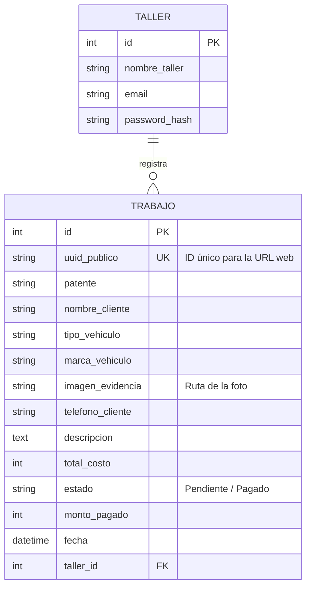
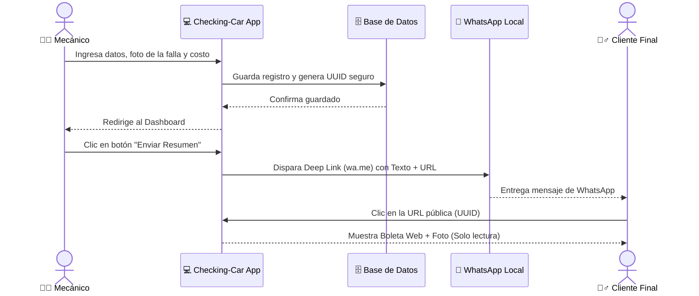

# checking-car
Enfoque: Región de La Araucanía (Adaptable a mecánicos de barrio y mecánicos de ruta/pueblo). Plataforma principal: Aplicación Web "Mobile-First" (Optimizada para usarse en el celular del mecánico con las manos sucias).


```markdown
# 🚗 Checking-Car (Vertical SaaS para Talleres Automotrices)

**Checking-Car** es un Software como Servicio (SaaS) diseñado específicamente para talleres mecánicos, focalizado en resolver tres problemas críticos del sector: **Generación de confianza** con el cliente mediante presupuestos visuales, **gestión ágil de historial** por patente, y **cobranza automatizada** de deudas ("fiados") a través de WhatsApp.

Desarrollado con una arquitectura **Mobile-First** (pensada para usarse desde el celular con las manos sucias), elimina la fricción tecnológica mediante botones grandes, alto contraste y flujos de 2 clics.

---

## ⚙️ 1. Lógica de Funcionamiento (Core Business Logic)

El sistema opera bajo un modelo híbrido B2B2C (Business to Business to Consumer), donde el Mecánico es el usuario del software, pero el Cliente Final consume el valor generado.

### A. Flujo del Mecánico (Panel Privado)
1. **Autenticación:** Acceso seguro mediante email y contraseña. El sistema aísla los datos (Multi-tenant básico), asegurando que el mecánico solo vea sus propios registros.
2. **Ingreso Rápido (Check-in):** El mecánico registra los datos del cliente, patente, tipo de vehículo y una **fotografía de evidencia** (vital para justificar reparaciones a turistas o flotas).
3. **Gestión Financiera:** El panel (Dashboard) permite filtrar rápidamente vehículos en estado `Pagado` o con `Deuda` (Pendiente).
4. **Distribución Zero-Cost:** En lugar de usar APIs de pago, el sistema utiliza **Deep Linking de WhatsApp (`wa.me`)** para abrir el chat del mecánico con un mensaje pre-armado que incluye el enlace de cobro o presupuesto.

### B. Flujo del Cliente / Turista (Vista Pública)
1. **Recepción:** El cliente recibe un WhatsApp del número del taller (generando confianza inmediata).
2. **Visualización Segura:** Al hacer clic en el enlace, accede a una **URL ofuscada por UUID** (Ej: `/cliente/presupuesto/f47ac10b...`), impidiendo que adivine URLs de otros clientes.
3. **Transparencia:** Ve su boleta digital adaptada a móviles, con la foto de la falla, detalle del mecánico y el monto total a pagar.

---

## 📊 2. Diagramas de Arquitectura

### A. Modelo de Base de Datos (Entity-Relationship)
*Relación Uno-a-Muchos entre el Taller y sus Trabajos.*


```



### B. Flujo de Usuario y Generación de Presupuesto (Sequence Diagram)
*Cómo interactúa el sistema con WhatsApp sin usar APIs de pago.*



---

## 🛠️ 3. Stack Tecnológico

*   **Backend:** Python 3.x con Flask (Application Factory Pattern).
*   **Base de Datos:** SQLite (Desarrollo) / PostgreSQL (Producción) gestionado vía `Flask-SQLAlchemy`.
*   **Seguridad:** `Flask-Login` para sesiones de usuario y `Werkzeug` para hashing de contraseñas. UUIDs para ofuscación de URLs públicas.
*   **Frontend:** HTML5 (Jinja2 Templates) + Tailwind CSS (vía CDN) para diseño responsivo rápido y moderno.

---

## 🚀 4. Guía de Instalación y Despliegue Local

Sigue estos pasos para levantar el proyecto en tu entorno local.

### Requisitos Previos
*   Python 3.8 o superior instalado.
*   Git instalado.

### Paso 1: Clonar y Preparar el Entorno
Abre tu terminal y ejecuta:
```bash
# 1. Clonar el repositorio (o crear la carpeta si lo tienes local)
git clone <url-de-tu-repo>
cd checking-car

# 2. Crear entorno virtual
python -m venv venv

# 3. Activar el entorno virtual
# En Windows:
venv\Scripts\activate
# En Mac/Linux:
source venv/bin/activate

# 4. Instalar dependencias
pip install -r requirements.txt
```

### Paso 2: Inicializar la Base de Datos
El proyecto incluye un script que crea las tablas y genera un usuario de prueba automáticamente.
```bash
# Ejecutar el poblador de base de datos
python crear_datos.py
```
*Si todo sale bien, verás el mensaje: `✅ ¡Datos creados exitosamente!`.*

### Paso 3: Ejecutar el Servidor
Inicia la aplicación en modo desarrollo:
```bash
python run.py
```
El servidor se levantará en `http://127.0.0.1:5000`.

### Paso 4: Probar el Sistema
1. Abre tu navegador en la ruta local.
2. Inicia sesión con las credenciales de prueba:
   * **Email:** `maestro@taller.cl`
   * **Contraseña:** `123456`
3. ¡Bienvenido al Dashboard del taller!

---

## 📁 5. Estructura del Proyecto

```text
checking-car/
│
├── app/
│   ├── __init__.py           # Factory de la aplicación Flask
│   ├── models.py             # Modelos de base de datos (SQLAlchemy)
│   │
│   ├── auth/                 # Módulo de Autenticación
│   │   └── routes.py
│   │
│   ├── taller/               # Módulo Privado (Mecánico)
│   │   └── routes.py         # Dashboard, Ingreso, Cobranzas
│   │
│   ├── cliente/              # Módulo Público (Turista/Cliente)
│   │   └── routes.py         # Visualización de presupuestos (UUID)
│   │
│   ├── static/               
│   │   └── uploads/          # Carpeta donde se guardan las fotos (Evidencias)
│   │
│   └── templates/            # Vistas HTML con Tailwind CSS
│       ├── base.html
│       ├── auth/login.html
│       ├── taller/dashboard.html
│       ├── taller/nuevo.html
│       └── cliente/presupuesto_publico.html
│
├── venv/                     # Entorno virtual
├── app.db                    # Base de datos SQLite local
├── crear_datos.py            # Script de inicialización de DB
├── requirements.txt          # Dependencias de Python
└── run.py                    # Archivo de arranque
```

---
*Desarrollado para revolucionar la gestión automotriz en La Araucanía.*
